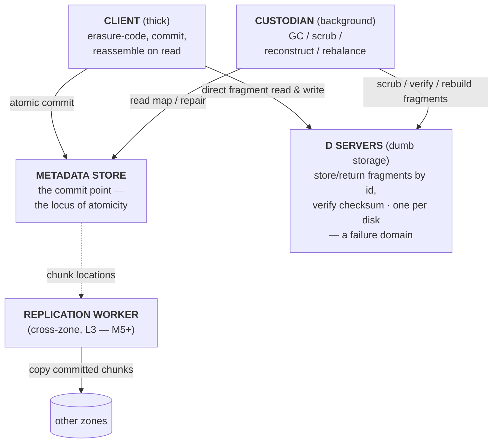

# 5. Building block view

> Living document. The system is described through **two complementary views**:
> the **actor view** (§5.1 — what the moving parts are and how they collaborate
> to perform an operation) and the **layer view** (§5.2 — how those parts map
> onto scope tiers, and why bulk data never crosses a shared component). They
> answer different questions and are both load-bearing: the actor view is how you
> *learn* the system; the layer view is how you understand its *scalability*. See
> `diagrams/c4-container.mermaid` for the container diagram (the actor view) and
> `diagrams/layer-stack.mermaid` for the layer stack.

## Why two views

The actor view and the layer view are two decompositions of the same system, cut
along different axes:

- **The actor view** answers *"what are the components, and how do they
  collaborate to do a write?"* It is the operational and learning frame — the one
  you reach for to explain the system or reason about a request. Its centre is the
  **commit point**.
- **The layer view** answers *"what scope does each part have, and why doesn't
  bulk data bottleneck on a shared component?"* It is the scalability frame — the
  one that justifies the whole architecture. Its decisive property is that the
  globally-scoped tier holds only tiny, high-value truth.

Neither subsumes the other. A component's *identity and collaborators* come from
the actor view; its *scope and the scaling consequences* come from the layer view.
The sections below give each in turn.

---

## 5.1 The actor view — the components and how they collaborate

The system is, at its core, **five components orbiting a single commit point**.
Everything else (gateways, coordination, replication) is in service of these.



The metadata store sits at the centre because the **atomicity guarantee lives in
one mutation there**; the other four components collaborate around it.

| Actor | One-line role | What it is, precisely |
|-------|---------------|-----------------------|
| **Metadata store** *(the commit point)* | Holds the map and hosts the single atomic mutation that makes a write visible. | The linchpin. Inodes, dirents, chunk maps, the pending-chunk ledger, version counters. The atomicity guarantee — the project's reason to exist — lives in *one mutation here*, not in any other component. `redb` embedded / TiKV production, behind `MetadataStore`. |
| **Client** *(the thick brain)* | Erasure-codes, writes fragments directly to D servers, issues the atomic commit, reconstructs on read. | Where the intelligence lives. It is the *only* component that understands what a *file* is: chunk → RS(k,m) encode → direct parallel fragment writes → atomic commit; on read, reconstruct from any *k* of *n*. Embedded in every L1 gateway. `client` crate, `reed-solomon-simd`. |
| **D server** *(dumb storage)* | Stores and returns fragments by id, verifies checksums, reports health. | Deliberately stupid: no placement logic, no metadata, no erasure coding, no reconstruction. A disk with a gRPC interface and a checksum check. **One per disk** — each is an independent failure domain (ADR-0034). `dserver` crate, `ChunkStore` trait. |
| **Custodian** *(background health)* | Keeps stored data healthy over time and emits durability telemetry. | Four jobs: **GC** (collect orphaned/failed-write garbage), **scrub** (re-verify checksums to catch bit-rot *before* it's needed), **reconstruct** (rebuild lost fragments when a D server dies), **rebalance** (drain hot/decommissioning servers). Reads and repairs against the metadata store and D servers. Emits the durability plane (ADR-0011). `custodian` crate. |
| **Replication worker** *(cross-zone, L3 — M5+)* | Replicates committed chunks between zones, asynchronously, off the foreground write path. | Copies whole committed chunks to other zones per policy; a remote replica becomes readable only once its catalog record commits. Async by default; sync-N-zone is a per-tenant opt-in. Does not exist at single-zone scale. `proto`/NATS JetStream. |

Holding these together, off the data path: **coordination (L5)** — service
discovery, leader election, locks — where D servers register and the custodian
leader-elects, so the actors can find one another.

### How they collaborate — the write path as actor interaction

The single most important collaboration, and the one that defines the system:

1. The **client** registers chunk ids in the **metadata store**'s pending-chunk
   ledger (leased; the file exists nowhere yet).
2. The **client** erasure-codes the data and writes fragments **directly to the
   D servers** — bulk data flows client→D-server, crossing no shared component.
   The D servers verify checksums. A failure here is harmless, unreferenced
   garbage.
3. The **client** issues *one atomic mutation* to the **metadata store**: write
   the chunk map, set `COMMITTED`, bump the version (conditional on the prior).
   **This is the commit point — the file now exists.** Concurrent writers conflict
   here; exactly one wins.
4. The **client** releases the ledger entries.

Later and asynchronously, the **custodian** scrubs the D servers' fragments
against the map, rebuilds any that are lost (committing the new locations via the
*same* atomic mutation pattern), and emits durability telemetry; the **replication
worker** (multi-zone) copies committed chunks to other zones. Readers never see a
hybrid — only the old version or the new.

The shape to carry away: **dumb storage at the bottom, a thick client and
background custodians holding the intelligence, and a metadata commit point at the
centre as the locus of atomicity — with cross-zone replication off to the side.**
The layer view (§5.2) now shows how these actors map onto scope tiers.

---

## 5.2 The layer view — scope tiers and the scalability property

The system is organized into five layers. L4 and L5 operate within a single zone (one datacenter) and are unaware that other zones exist. L1, L2, and L3 are the layers that span zones. The decisive property throughout: **the layer with global scope (L2) holds only small, slow-changing, high-value truth, so it can afford global consensus without becoming a bottleneck**, while bulk data flows directly between client and storage servers, crossing no shared component.

```
L1  Access layer            S3 / FUSE / WebDAV / SDK gateways      (stateless)
L2  Global control plane     namespace, placement, ACLs, registry   (global consensus)
L3  Cross-zone replication    async chunk copy, global custodians    (off the data path)
L4  Zonal file system         metadata store, D servers, custodians, client library
L5  Bootstrap & coordination  service discovery, leader election, locks, config
```

Where the §5.1 actors live: the **client** is defined in L4 but *embedded in* the
L1 gateways; the **metadata store**, **D servers**, and **custodians** are L4
(zonal); the **replication worker** is L3 (cross-zone); **coordination** is L5.
The actors are unchanged — this view re-cuts them by scope.

---

### L1 — Access layer

Stateless protocol translators. They hold no durable state, scale horizontally, authenticate the caller, and embed the client library (L4) to do the actual storage work. All consistency logic lives below them.

| Component | Technology | Responsibility |
|-----------|------------|----------------|
| S3 gateway | Rust, `gateway-s3` crate | Primary integration surface; object semantics over the file system |
| FUSE / NFS | `fuser` crate; NFS-Ganesha | POSIX-ish access; deliberately second-class |
| WebDAV / Drive | Rust | The consumer Drive surface: sync, sharing links, web UI |
| Native SDK | gRPC + prost | The real interface; streaming reads, atomic commit, append, CAS |

---

### L2 — Global control plane

The brain of the multi-zone system: the one component with a global, authoritative view of what exists and where it should live. It controls by *deciding and recording*; it distributes by *routing actors to the right zones*, never by carrying the payload itself.

| Component | Technology | Responsibility |
|-----------|------------|----------------|
| Global namespace DB | redb (single-zone) / TiDB (multi-region), behind `NamespaceStore` trait (ADR-0020) | Directory tree, file→home-zone mapping, ACLs, sharing, quotas. Globally linearizable, synchronously geo-replicated. |
| Placement service | Rust, policy engine | Decides home zone and replica set per file from policy (residency, replication factor, cost tier, capacity) |
| Zone registry | in the namespace DB | Every zone: region, capacity, utilization, health, capabilities |
| Identity & auth | OIDC for users; internal mTLS PKI for services | Trust fabric (single-provider, so internal PKI not cross-org) |

Holds *metadata about metadata* — kilobytes per file. Consulted on namespace and placement operations (create, rename, share, delete, "where do I read this"), which are rare relative to data operations and ideally cached by clients.

The default L2 backend is the Apache-2.0, CNCF **TiKV** stack — **TiDB** for the SQL surface over it — with **YugabyteDB** or **PostgreSQL** as alternatives behind the `NamespaceStore` trait (ADR-0020). CockroachDB is Spanner-class and works as a backend, but it is **not** a default: it moved to a source-available (non-OSI) licence in 2024, which is at odds with the project's fully-open, sovereignty-friendly substrate goal.

---

### L3 — Cross-zone replication

Turns independent single-datacenter systems into one geographically distributed system, without ever sitting on the foreground write path.

| Component | Technology | Responsibility |
|-----------|------------|----------------|
| Replication workers | Rust; NATS JetStream queue | Copy committed chunks between zones per policy; sync within a region, async across continents |
| Replica catalog | in L2's DB | Tracks which zones hold valid replicas; a replica exists only once its record commits |
| Global custodians | Rust | Disaster recovery: detect zone loss, find under-replicated files, schedule re-replication from survivors |

Default replication is **async** (home-zone commit acknowledges immediately). **Sync N-zone** replication is a per-tenant opt-in that eliminates the data-loss window at the cost of cross-region write latency.

---

### L4 — Zonal file system (the Colossus analog, one per datacenter)

Where atomicity lives and where the bulk of correctness risk concentrates.

| Component | Technology | Responsibility |
|-----------|------------|----------------|
| Metadata store | `redb` (embedded) / TiKV (prod), behind `MetadataStore` trait | Inodes, dirents, chunk maps, the pending-chunk GC ledger, version counters. Hosts the single atomic mutation that *is* the commit point. |
| D servers | Rust, `dserver` crate; `ChunkStore` trait (local / filesystem / S3) | Store/retrieve EC fragments by chunk ID, verify checksums, report health. Deliberately dumb — no placement logic, no metadata. |
| Custodians | Rust, `custodian` crate | GC (expired pending chunks, orphans), scrubbing (checksum verification → bit-rot detection), reconstruction (rebuild lost fragments from survivors), rebalancing. Emit durability telemetry. |
| Client library | Rust, `client` crate; `reed-solomon-simd` | Chunk → erasure-code → direct parallel fragment writes → atomic commit. Small-file inlining. Append/CAS. Read reconstruction from any *k* of *n* fragments. |

A zone is the unit of atomicity and the unit of (intra-provider) federation.

#### The metadata model

Hierarchical: **inode + dirent**, not path-as-key.

- `inode:<id>` → attributes, chunk map (or inline data for small files), state, version.
- `dirent:<parent_id>/<name>` → child inode id.

This makes rename a single dirent mutation (atomic under the same mechanism as a write) instead of a mass key rewrite, and makes cross-zone sharing expressible (a dirent pointing at an inode owned elsewhere). It is the strongest concrete driver of the TiKV-over-HBase choice, because file creation must atomically write both the inode and its dirent — a multi-key transaction. See section 6 and ADR-0008.

#### The write protocol (the commit point)

The same collaboration described in §5.1 as actor interaction, here in terms of
the L4 mechanics it touches:

1. **Intent** — client registers chunk IDs in the pending-chunk ledger with a lease. The chunks exist nowhere in the namespace.
2. **Data path** — client erasure-codes and writes fragments directly to D servers, which verify checksums. Failures here are harmless garbage.
3. **Commit** — one atomic metadata mutation writes the chunk map + sets state `COMMITTED` + bumps the version, conditional on the prior version. **This is the atomicity.** Concurrent writers conflict here; exactly one wins.
4. **Release** — delete the ledger entries. Crash between 3 and 4 leaves the ledger to a custodian sweep; crash before 3 leaves leased garbage for GC.

Readers never consult the ledger; they see the old version or the new one, never a hybrid.

---

### L5 — Bootstrap and coordination

The smallest layer by data volume and the one everything else depends on. It answers the questions a distributed system must answer before it can do any real work. Stores kilobytes; never on the data path.

| Component | Technology | Responsibility |
|-----------|------------|----------------|
| Coordination service | etcd (prod) / in-memory (dev), behind `Coordination` trait | Service discovery (leased registration), leader election (single active custodian), distributed locks with fencing tokens, zone-wide config with change notification |
| Deployment substrate | systemd / docker-compose / Kubernetes operator | Process lifecycle. Pluggable; the binary never couples to orchestrator APIs (ADR-0010). |

The Colossus-style bootstrap recursion bottoms out here: etcd depends on nothing above it. Losing L5 loses no data; established connections keep working from cached state. What is lost is the ability to *react* — failovers, elections, topology changes — until coordination returns.

**openraft** is reserved as a future embedded coordination backend (a no-external-dependency production mode) behind the same trait, validated by the existing DST harness once the trait semantics are pinned by two implementations. Not built for v1 (ADR-0006).

---

## 5.3 Cross-cutting components

| Concern | Technology | Crate / location |
|---------|------------|------------------|
| Wire contracts | protobuf + prost | `proto` |
| On-disk format | versioned, spec-first | `chunk-format` + `specs/chunk-format/` |
| Pluggability seams | trait definitions, no impls | `traits` (`ChunkStore`, `MetadataStore`, `NamespaceStore`, `Coordination`) |
| Telemetry | OpenTelemetry (OTLP) | `telemetry` (ADR-0012) |
| Simulation testing | madsim / turmoil | `testkit` (ADR-0009) |
| Composition / the binary | wires all concretes | `server` |

The dependency rule (ADR-0010): implementations and consumers depend on `traits`, never on each other's concretes. Only `server` knows the concrete backends, which is what makes "swap redb for TiKV" or "in-memory for etcd" a composition change rather than a refactor.
