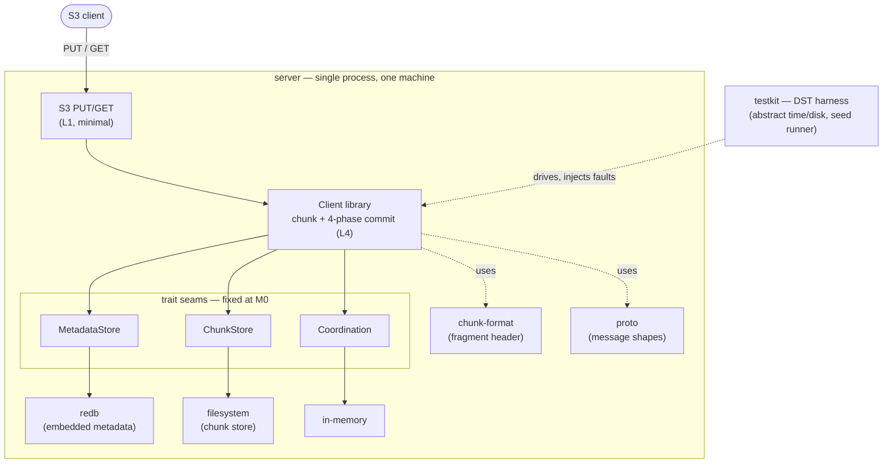

# Proposal: Milestone 0 — the walking skeleton (implementation plan)

> This is the bootstrap proposal: the implementation plan for the project's first vertical slice. It is filed as a proposal because the template fields map cleanly onto an implementation plan and the process is deliberately lightweight this early (see `../README.md`). It records *how* M0 is built; the *why* of the architecture lives in the ADRs it references. M0 is the first slice of the whole [implementation arc](0002-implementation-arc.md) (proposal 0002), which orders every milestone it begins.

## Motivation

Milestone 0 proves the **commit protocol — the entire differentiator** — end to end in a single process: one atomic write and one read, with the commit shown atomic under fault injection in simulation. Per the build strategy ([architecture §4.2][s4], [§9][s9]) this is a **vertical slice**, not bottom-up: the layers that matter for one real operation, wired thinly, then widened by risk in later milestones.

Building this slice first de-risks the project's central claim before any breadth (erasure coding, networked storage, custodians, multi-zone) is added, and it establishes the trait seams and the DST harness that everything after it attaches to.

## Design

### Scope boundary

In scope: S3 PUT/GET (minimal) → client library (chunk + commit) → embedded metadata store (redb) → filesystem chunk store → in-memory coordination, plus the `testkit` DST harness and the commit-protocol property tests.

Explicitly **out** of M0 (deferred to the risk-ordered widening in [§9][s9]): erasure coding (`replication(1)`/`none` only), networked gRPC D servers, custodians, TiKV, every cross-zone layer (L2/L3), and **observability / telemetry**. Their *hooks* are respected where retrofitting is expensive (see Backward compatibility).

Observability is deliberately **not implemented in M0**: the durability-plane telemetry is emitted by the custodians ([ADR-0011][a11]), so it arrives with them at M3; the instrumentation seam is OpenTelemetry ([ADR-0012][a12]), wired at that point; and M0 is verified by DST, not by metrics. Unlike the append/CAS/watch and version-fence hooks, it needs **no reserved seat now** — attaching telemetry at the custodian is not an expensive retrofit.

### Deliverable

M0's output is a **proof, not a product**: a single binary that runs S3 PUT → four-phase commit → byte-identical GET in one process, plus a **seed-reproducible DST proof that the commit is atomic** (the property tests below), the trait and test scaffold (`ChunkStore` / `MetadataStore` / `Coordination` + `testkit`) every later milestone attaches to, and the on-disk format ([ADR-0019][a19]) implemented (v0/unstable) with a conformance vector. It is a credible, publishable proof-of-concept — *the central claim is no longer a claim* — even if nothing follows. It is explicitly **not** deployable (no EC, no networked servers, no durability promise); a usable single-zone product is M4.

### Workspace and crate scaffold (coarse start, [ADR-0016][a16])

A Cargo workspace, starting **coarse** and splitting later. Trait boundaries exist from day one even where crate boundaries do not. `Cargo.lock` is committed (this is an application).

| Crate | M0 contents | Notes |
|-------|-------------|-------|
| `chunk-format` | Fragment header encode/decode against [the spec][spec] | Dependency-light; spec-first ([ADR-0002][a2]) |
| `proto` | Minimal protobuf/prost message shapes (commit, chunk put/get) | gRPC *transport* deferred to widening step 2; shapes defined now |
| `traits` | `ChunkStore`, `MetadataStore`, `Coordination` definitions only | The keystone — consumers/impls depend here, never on concretes ([ADR-0010][a10]) |
| `core` | Client library, commit protocol, redb `MetadataStore`, filesystem `ChunkStore`, in-memory `Coordination` | Combined crate; split as boundaries firm up ([ADR-0016][a16]) |
| `testkit` | Abstract time/disk; deterministic seed-driven runner; fault-injection hooks | First-class, not a helper ([ADR-0009][a9]) |
| `server` | The binary; wires concretes; hosts minimal S3 PUT/GET | Only crate that knows concrete backends |
| `xtask` | Codegen, conformance-vector run | `cargo xtask <thing>`; no `make` ([ADR-0016][a16]) |

CI adds `cargo build/test/fmt/clippy`; the `adr-immutability` check already exists.

### Logical view

M0 collapses the L1–L5 layer model into a **single process** — a vertical slice through L1, L4, and L5, behind the three trait seams. There is no L2 (namespace/placement) or L3 (cross-zone) yet; the concretes are M0-trivial, but the seams are real from day one.

Deferred to later milestones, absent from M0: L2 (namespace DB, placement, zone registry), L3 (cross-zone replication, global custodians), networked gRPC D servers, custodians, and erasure coding. The fourth trait seam, `NamespaceStore` ([ADR-0020][a20]), is deferred too: M0 has no global namespace or placement, so its only namespace is the **local** inode/dirent inside `MetadataStore` — there is no M0 behaviour behind a `NamespaceStore` to retrofit. It is introduced with L2, where ADR-0020 folds it onto the same embedded store in single-zone profiles.

### Metadata model — redb behind `MetadataStore` ([§5 L4][s5])

Hierarchical **inode + dirent**, not path-as-key, so create writes inode + dirent atomically and rename is a single dirent mutation:

- `inode:<id>` → attributes, chunk map (or inline data for small files), state, version.
- `dirent:<parent_id>/<name>` → child inode id.
- `pending:<chunk_id>` → lease/expiry — the pending-chunk GC ledger.
- `meta:version` counter **reserved now** for the [ADR-0015][a15] consistency fence (not yet enforced).

The atomic commit is a **single redb write transaction** spanning these keys. That transaction *is* the commit point.

### Chunk / fragment format (`chunk-format` + [the spec][spec])

The byte layout is **already decided and specified** — the 44-byte v1 header (magic, `format_version`, a self-describing `header_length`, `flags`, `checksum_algo`, `encryption_scheme`, the per-fragment EC fields, a u128 `chunk_id`, `payload_length`, and a `header_checksum`), little-endian and fixed-width, with crc32c the default payload checksum (blake3 reserved) computed over the *stored* bytes ([the spec][spec], [ADR-0019][a19]). M0 **implements that spec** in the `chunk-format` crate and lands the first seed **conformance vectors** in `specs/conformance/` — it does not redesign the format. For M0 the EC scheme is `replication(1)`/`none`, but it is recorded per fragment so later mixed-era data reads correctly. The format stays **v0 / unstable** — `v1` is stamped only after a second independent reader or a sustained fault-injection run validates it (the spec's own rule).

### Write / commit protocol (the differentiator) — [§5][s5]

Implement all four phases:

1. **Intent** — client registers chunk ids in the pending ledger with a lease. The chunks exist nowhere in the namespace.
2. **Data path** — client writes fragment(s) to the filesystem `ChunkStore`, which verifies checksums. Failures here are harmless garbage.
3. **Commit** — one atomic redb transaction writes the chunk map, sets state `COMMITTED`, and bumps the version **conditional on the prior version**. Concurrent writers conflict here; exactly one wins. **This is the atomicity.**
4. **Release** — delete the ledger entries.

Crash between 3 and 4 leaves ledger entries for a sweep; crash before 3 leaves leased garbage. M0 has no custodians, so a **minimal ledger-sweep function** (invoked by tests, not a running service) stands in; the full custodian is a later milestone. Readers never consult the ledger — they see the old version or the new one, never a hybrid.

### Access (L1) and coordination (L5), minimal

- **S3 PUT/GET** in `server`: PUT object → client write path; GET → read path (single fragment, since `replication(1)`). Just enough for an end-to-end test; full S3 semantics are deferred.
- **In-memory `Coordination`** behind the trait: discovery / leader election / locks are trivial in one process, but the trait shape is fixed now so etcd drops in later as a composition change.

### Configuration

M0's configuration surface is deliberately small — one process, one machine. Outline of the knobs that exist (the *format* — file / env / flags — is an implementation detail, not decided here):

- **server** — the S3 gateway
  - `listen` — bind address for PUT/GET (e.g. `127.0.0.1:9000`)
- **metadata** — `MetadataStore` (redb at M0)
  - `path` — the redb database file
- **chunks** — `ChunkStore` (filesystem at M0)
  - `dir` — the chunk-store root directory
- **commit** — commit-protocol parameters
  - `pending_lease` — expiry on intent-phase chunks (the GC ledger entry)
- **format** — on-disk format
  - `durability` — `none` | `replication(n)` | `rs(k,m)`; **fixed to `replication(1)`/`none` at M0**, recorded per chunk

**Hardcoded defaults at M0, not yet knobs:** the small-file **inline threshold** and **chunk/stripe size** (the `[OPEN]` empirical parameters, deferred to measurement). The **checksum algorithm** is not a knob — it is fixed by the format to crc32c, carried as `checksum_algo` in the header (blake3 reserved; [ADR-0019][a19]).

**Not configuration at M0:** backend selection is **code composition in `server`** (redb / filesystem / in-memory), not a runtime flag — swapping a backend is a composition change, not config ([ADR-0008][a8]). Zone/region, replication factor, placement policy, coordination endpoints, and telemetry have no config because L2, networked coordination, and observability are not in M0. The **DST seed** is a test-runner input, not server config.

The full "same system, configured differently" profile model ([ADR-0014][a14]) and the declarative, API-first management surface ([ADR-0013][a13]) arrive with L2 and the custodians — not at M0. M0 config is just *where is the data, what port, how long are leases.*

### DST harness + property tests — attach at M0 ([ADR-0009][a9])

`testkit` provides abstract time/disk and a single-threaded, seed-reproducible runner. The commit-protocol property tests assert the core invariants:

- Concurrent writers to the same inode: **exactly one commit wins**; the loser observes the version conflict.
- A reader sees either the pre-commit or post-commit version, **never a hybrid**.
- **Fault injection**: crash between phases 3 and 4 → the file is either fully visible or not at all, and no committed chunk-map entry references a fragment the sweep would reclaim.

### Test harness implementation

The harness has **two tiers, kept distinct**:

- **Tier 1 — DST correctness (`testkit`), from M0, no containers.** Production logic is written against `testkit`'s abstract time / disk / (later) network plus the trait seams, then run in a single-threaded, seed-reproducible simulator. **madsim** is the primary runtime — it simulates time, scheduling, network, and randomness ([ADR-0009][a9]). A container is deliberately *not* used here: it would reintroduce the real clock, scheduler, and network that DST exists to remove, breaking reproducibility. Entry points are `cargo test` (property tests) and `cargo xtask` (longer sim campaigns, conformance vectors); it runs on a laptop and in CI.
- **Tier 2 — integration against real backends, from M2+, containers.** When the in-process redb/filesystem stores are swapped for networked gRPC D servers, TiKV, and etcd, those services run under docker-compose / testcontainers for (non-deterministic) integration tests, and Jepsen drives adversarial consistency against a real cluster. None of this exists in M0.

For M0 the only tier is Tier 1: in-process DST on madsim — no containers, no services.

### Environment, and what is not tested yet

- **Hardware:** a single developer machine — laptop or workstation. Everything is one process (embedded redb, filesystem chunks, in-memory coordination), and DST simulates concurrency and faults deterministically, so M0 needs no cluster, no networked nodes, and no infrastructure. The first hardware beyond a laptop appears at M2 (networked D servers).
- **Correctness** is the whole point and is covered above: deterministic simulation (`testkit`, seed-reproducible), the commit-protocol property tests, fault injection, and the format conformance vectors — all in CI (`cargo build/test/fmt/clippy`).
- **Performance is deliberately out of scope for M0.** DST abstracts time and runs single-threaded, so it proves correctness, not throughput — wall-clock numbers from the simulation are meaningless. Real benchmarks begin at M1 (Reed-Solomon micro-benchmarks in CI); the throughput-scaling claim (architecture §10, scenario Q6) is only measurable at M2+ on real hardware. The empirical open questions (small-file inline threshold, chunk/stripe size) are deferred to those measurements, not guessed now.

### CI

GitHub Actions — the repo's existing platform (`adr-immutability` and `docs` workflows already run). M0 adds a `ci` workflow that is a thin caller of **`cargo xtask ci`** (logic in Rust, not YAML, so it runs identically on a laptop — [ADR-0016][a16]), gating every PR on:

- `cargo fmt --check`, `cargo clippy -D warnings`, `cargo build`, `cargo test` — the DST commit-protocol property tests run here, on madsim ([ADR-0009][a9]);
- `cargo xtask conformance` — the `chunk-format` reader against `specs/conformance/` ([ADR-0002][a2]);
- **DCO** sign-off on every commit and **`cargo-deny`** (permissive-license allowlist + RUSTSEC advisories), enforcing [ADR-0003][a3] in CI.

All on `ubuntu-latest`, deterministic, with no services or containers (Tier 1). A DST seed that finds a bug is committed as a permanent regression test. The integration tier (containers, Jepsen, benchmarks) arrives with the networked milestones, not M0. The full testing-and-CI strategy is [ADR-0009][a9].

## Alternatives considered

- **Bottom-up** (all D servers / EC first): rejected by [§4.2][s4] / [ADR-0009][a9] — a vertical slice proves the differentiator sooner and gives every layer a trivial-then-real path.
- **Fine-grained crates from day one**: rejected by [ADR-0016][a16] (premature Cargo plumbing and visibility friction); a combined `core` now, split later.
- **Networked gRPC D servers in M0**: deferred to widening step 2 — the in-process filesystem store proves the commit protocol with far less surface; the `ChunkStore` trait means the swap is composition, not refactor.
- **Full S3 compatibility in M0**: deferred — minimal PUT/GET is enough to drive the slice end to end.

## Graduation criteria (definition of done)

- A file written via S3 PUT is read back via GET **byte-identical**.
- The commit is **proven atomic under fault injection in simulation**, reproducible from a seed.
- Commit-protocol property tests are green; `fmt`/`clippy` clean; `Cargo.lock` committed.
- The reference `chunk-format` reader/writer implements [the spec][spec] ([ADR-0019][a19]) and accepts at least one conformance vector in `specs/conformance/`.

### Suggested PR sequence (each with its own definition of done)

Each step is one PR, tracked under the **M0** milestone (parent tracker in the `tracking-issue` frontmatter):

1. **Workspace scaffold** — `traits`, `proto`, `testkit` skeleton, `xtask`, and CI (`cargo xtask ci`, cargo-deny, DCO).
2. **`chunk-format`** encode/decode against the spec ([ADR-0019][a19]) + first conformance vectors.
3. **redb `MetadataStore`** (inode / dirent / pending ledger / `meta:version`) behind the trait.
4. **Filesystem `ChunkStore`** behind the trait.
5. **Client write/commit path** — the four phases + the minimal test-invoked ledger-sweep.
6. **Client read path** — chunk map → fragment → checksum verify → return.
7. **In-memory `Coordination`** behind the trait.
8. **Minimal S3 PUT/GET** in `server` + end-to-end write/read test.
9. **DST property tests** + crash-between-3-and-4 fault injection.

## Backward compatibility

- **On-disk format**: the byte layout is fixed by [ADR-0019][a19] / [the spec][spec] (still **v0 / unstable** until validated, then stamped `v1`); M0 implements it. No existing data to migrate.
- **Deferred-with-reserved-seats** honored now because retrofitting is expensive ([§9][s9]): append/CAS/watch primitives ([ADR-0007][a7]) accommodated by the ledger + schema shape; the `meta:version` fence counter reserved ([ADR-0015][a15]); trait seams for etcd/TiKV/openraft; and the chunk format's **encryption reservation** (`flags`, `encryption_scheme`, header extension), which the M0 writer fills with zeros ([ADR-0019][a19], [ADR-0021][a21]).
- **API / deployments**: none yet, so nothing to stay compatible with.

## Open questions

All of M0's originally-open questions are now dispositioned (cf. proposal 0002's open-questions triage):

- **Small-file inline threshold** ([§5][s5]) — **deferred to measurement** (empirical; set against M1+ benchmarks), so it is *not* implemented in M0.
- **Minimal S3 in `server` vs a `gateway-s3` crate** — **combined `server` at M0**, split later under the crate-evolution rule ([ADR-0016][a16]).
- **redb key encoding** (byte order of `<id>`, dirent name normalization) — **settled during M0** as an implementation detail of the first metadata backend, recorded in-code and in the architecture doc.

No open question blocks M0.

[s4]: ../../architecture/04-solution-strategy.md [s5]: ../../architecture/05-building-block-view.md [s9]: ../../architecture/09-build-order-and-roadmap.md [spec]: ../../specs/chunk-format/v1.md [a2]: ../../adr/0002-spec-first-on-disk-format-only.md [a7]: ../../adr/0007-reserve-append-cas-watch.md [a9]: ../../adr/0009-deterministic-simulation-testing.md [a10]: ../../adr/0010-pluggable-deployment-substrate.md [a15]: ../../adr/0015-consistency-contract.md [a16]: ../../adr/0016-monorepo-and-crate-structure.md [a3]: ../../adr/0003-apache-2-license-and-dco.md [a8]: ../../adr/0008-tikv-metadata-and-pluggable-backends.md [a11]: ../../adr/0011-durability-telemetry-and-declarative-management.md [a12]: ../../adr/0012-opentelemetry-instrumentation.md [a13]: ../../adr/0013-api-first-management.md [a14]: ../../adr/0014-single-binary-dev-only.md [a19]: ../../adr/0019-chunk-format-layout.md [a20]: ../../adr/0020-global-namespace-store.md [a21]: ../../adr/0021-encryption-at-rest-and-key-management.md
